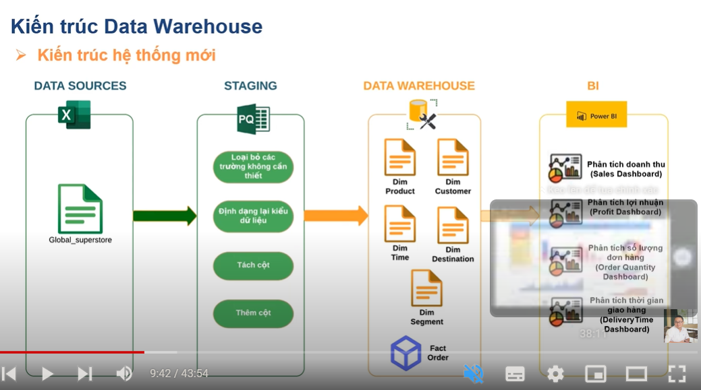

## Kiến trúc hệ thống phân tích dữ liệu

### Kiến trúc hệ thống cũ

Data Sources
csv
excel

<!--  -->

Database storage
table
mysql

<!--  -->

Users
reporting
Power BI

### Yêu cầu cải tiến

Data Sources
csv
excel

<!--  -->

Staging
Thủ tục ETL
Data validation
Data cleaning
Data trànorming
Data aggg
Data loading
mysql

<!--  -->

Data Warehouse  
(dim fact)
mysql

<!--  -->

Users
Data Analysis
Reports
Data Mining
Power BI

<!--  -->

<!-- https://www.canva.com/design/DAGDr5h1pEE/gsFg-GK1Y2-pzTf8nBDexA/edit?utm_content=DAGDr5h1pEE&utm_campaign=designshare&utm_medium=link2&utm_source=sharebutton -->

<!-- https://www.canva.com/design/DAGDrwKlKDU/5tBfEI7Mzsp5s6nIUIs7Tw/edit?utm_content=DAGDrwKlKDU&utm_campaign=designshare&utm_medium=link2&utm_source=sharebutton -->

<!-- https://www.canva.com/design/DAGDr7K5Yq0/Z64jK07TlLNI0mGCIvUdrQ/edit?utm_content=DAGDr7K5Yq0&utm_campaign=designshare&utm_medium=link2&utm_source=sharebutton -->

<!-- https://www.canva.com/design/DAGDrwE3P6s/0GVeEFesokKj0oLIIrbjhg/edit?utm_content=DAGDrwE3P6s&utm_campaign=designshare&utm_medium=link2&utm_source=sharebutton -->
