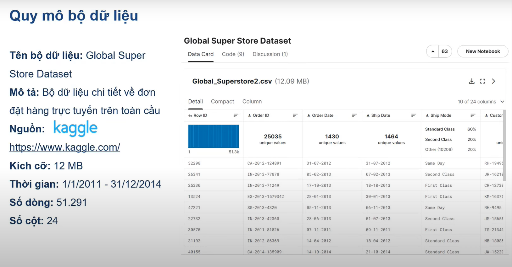
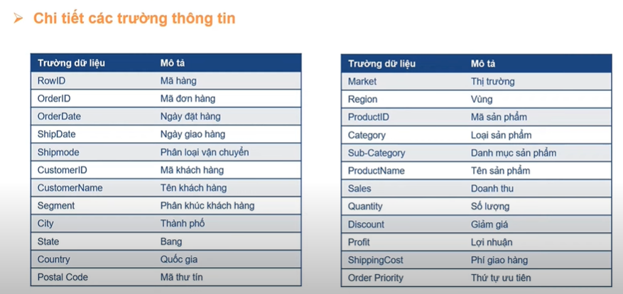

## Quy mô của dữ liệu

Mô tả: Tập dữ liệu về xxxx từ năm 2222 đến năm 2222
Nguồn dữ liệu: kaggle
Kích thước bộ dữ liệu: xxxxx > 100 MB
Số bản ghi: xxxxx? dòng cột
Gồm xxxx files: xxx, xxx

<!-- Thời gian tăng, dự đoán... -->

## Mô tả thông tin dữ liệu

<!-- Mô tả các trường dữ liệu -->

Bảng xxx, dòng xxx để làm gì
