[text](<Danh sách thành viên.md>)

# Khảo sát

[text](HRM.md)
[text](<Business Model Canvas.md>)

## Quy trình nghiệp vụ

Bảng UML

## Yêu cầu (Requirement tttttt)

### Tình hình hiện tại

Data Sources + Database storage + report

### Yêu cầu cải tiến

Yêu cầu
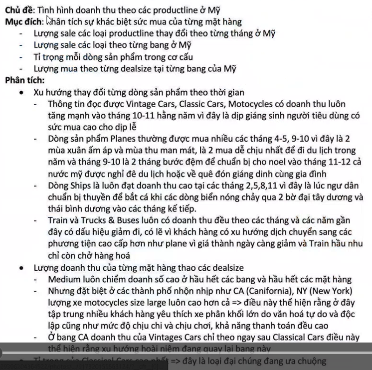
Phân tích xxxx theo xxxx

## Quy mô của dữ liệu

Mô tả: Tập dữ liệu về xxxx từ năm 2222 đến năm 2222
Nguồn dữ liệu: kaggle
Kích thước bộ dữ liệu: xxxxx > 100 MB
Số bản ghi: xxxxx? dòng cột
Gồm xxxx files: xxx, xxx

<!-- Thời gian tăng, dự đoán... -->

## Mô tả thông tin files

<!-- Mô tả các trường dữ liệu -->

Bảng xxx, dòng xxx để làm gì

## Data Exploration (Khám phá dữ liệu)

taxpomy
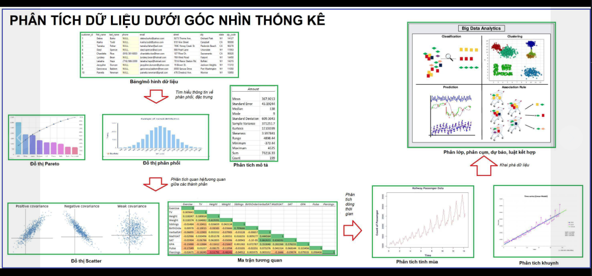

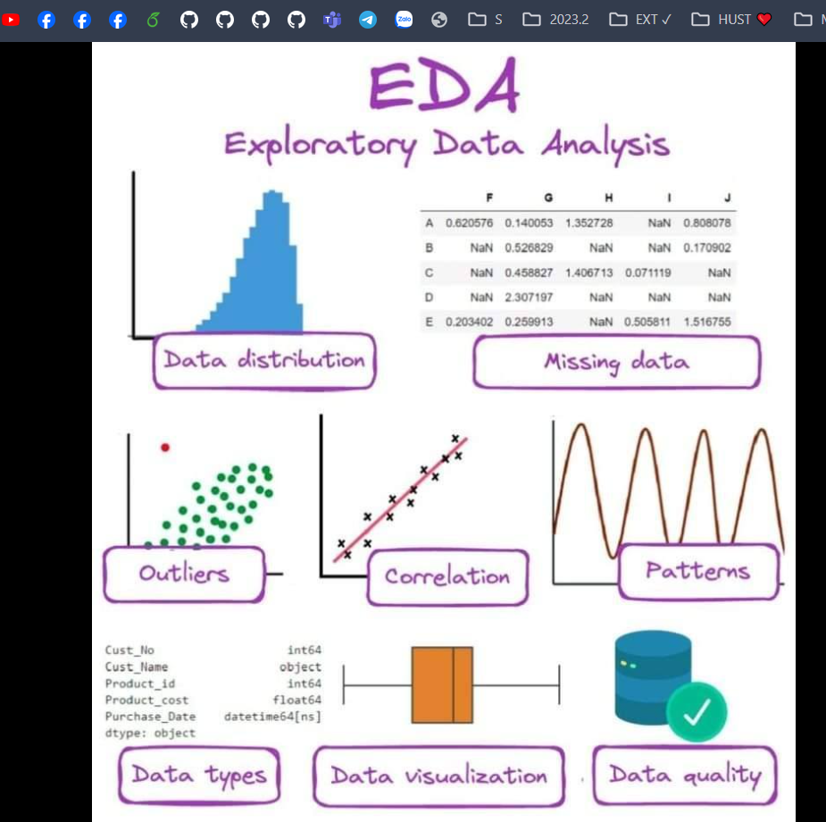

<!-- 🍀 Bước 3: Phân tích phân phối và đặc trưng của từng chiều -->

Sau khi liệt kê từng chiều. Bạn có thể tiến tới phân tích phân phối, đặc trưng của từng chiều đó.

Ta có thể mô tả phân bố này trên nhiều fact với cùng 1 dim.
🌳 Ví dụ:
👉 Phân bố doanh thu theo khu vực
👉 Phân bố khách hàng theo khu vực
👉 Phân bố doanh thu theo kênh marketing
👉 Phân bố khách hàng theo độ tuổi
👉 Phân bố các dự án theo mã nguồn
👉 Phân bố thời lượng sử dụng ứng dụng theo thời gian (khung giờ, tuần, ngày,...)

Từ đó bạn cũng tính được các đặc trưng như:
👉 doanh thu trung bình một đơn hàng
👉 Độ tuổi trung bình của khách hàng
👉 Khung giờ nào user vào ứng dụng nhiều nhất,...

<!-- ✍️ Hướng dẫn: bạn sử dụng tính năng pivot table, pivot chart hoặc sử dụng add-in Data Analysis để thống kê và vẽ các đặc trưng này -->

# Phân tích và Thiết kế

## Kiến trúc hệ thống phân tích dữ liệu

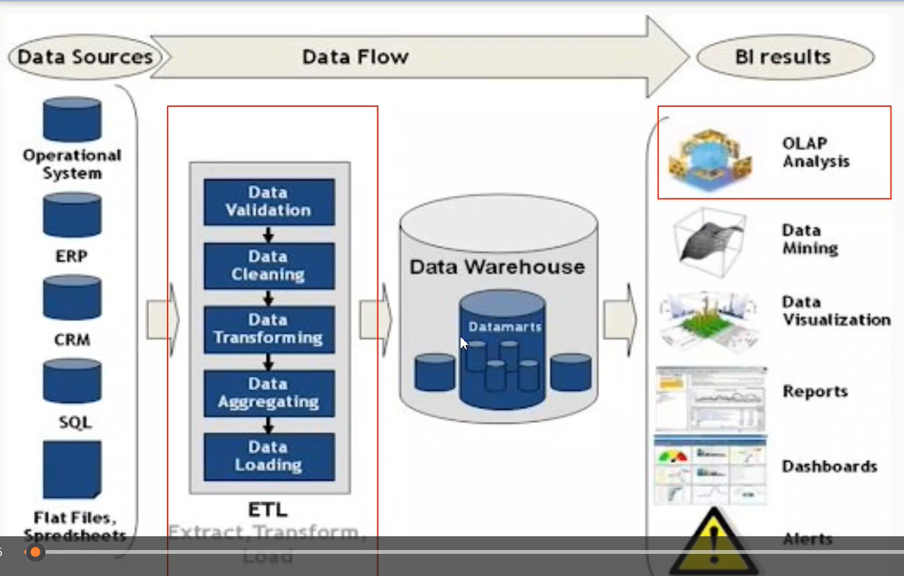
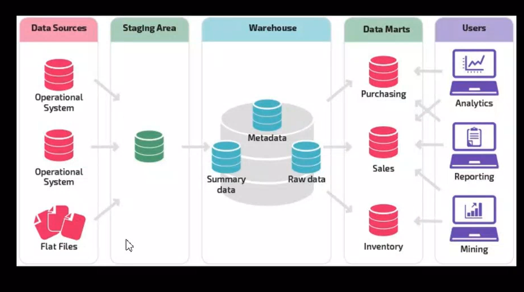
1 Data Sources
2 Staging
3 Data Warehouse  
4 BI

<!-- Data mart -->
<!-- Decision Making -->

<!-- https://www.canva.com/design/DAGDr5h1pEE/gsFg-GK1Y2-pzTf8nBDexA/edit?utm_content=DAGDr5h1pEE&utm_campaign=designshare&utm_medium=link2&utm_source=sharebutton -->

<!-- https://www.canva.com/design/DAGDrwKlKDU/5tBfEI7Mzsp5s6nIUIs7Tw/edit?utm_content=DAGDrwKlKDU&utm_campaign=designshare&utm_medium=link2&utm_source=sharebutton -->

<!-- https://www.canva.com/design/DAGDr7K5Yq0/Z64jK07TlLNI0mGCIvUdrQ/edit?utm_content=DAGDr7K5Yq0&utm_campaign=designshare&utm_medium=link2&utm_source=sharebutton -->

<!-- https://www.canva.com/design/DAGDrwE3P6s/0GVeEFesokKj0oLIIrbjhg/edit?utm_content=DAGDrwE3P6s&utm_campaign=designshare&utm_medium=link2&utm_source=sharebutton -->

## Quy trình ETL

github action + Window + kaggle + ETL ...

## Thực hiện ETL

Proxudures Thủ tục
Mục đích + Code + BEFORE + AFTER

## Mô hình dữ liệu Logic

<!-- Mô hình dữ liệu OLAP   OLAP trung tên bên dướiii -->

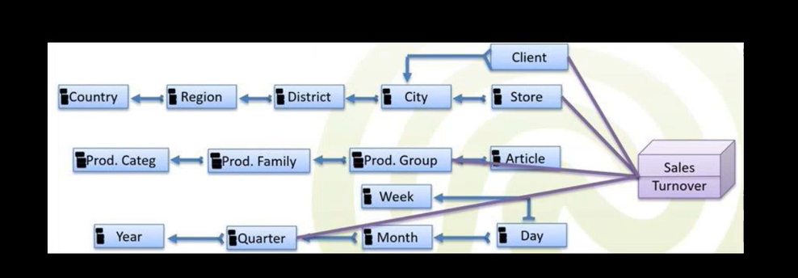
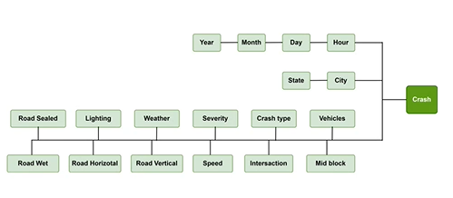

# Xác định các chiều khái niệm

<!-- Ghi thêm số lượng (3 phòng ban...) -->
<!-- 3,4,6,8 -->

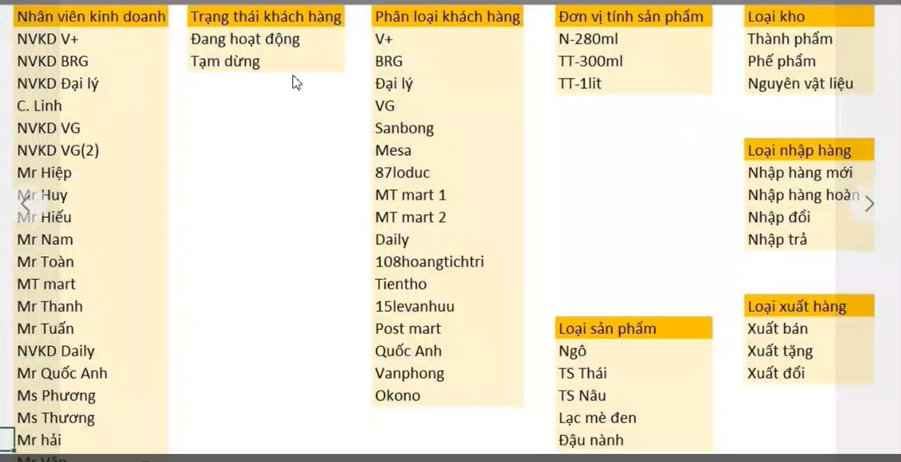
🍀 Bước 1. Xác định các chiều (Dimension) và Giá trị phân tích (Facts) của khối dữ liệu

🍀 Bước 2: Xác định hệ thống các chiều
🌳 Ví dụ:
👉 khu vực của khách hàng thì cụ thể là các khu vực nào
👉 độ tuổi của khách hàng thì cụ thể là các độ tuổi nào
👉 sản phẩm thì cụ thể danh sách các sản phẩm là gì
👉 dữ liệu trong khoảng thời gian nào (mấy năm, mấy tháng)

<!-- ✍️ Hướng dẫn: Bạn sử dụng tính năng remove duplicate với từng cột dữ liệu để tạo ra từng chiều rồi copy vào một sheet. -->

<!-- ! -->
<!-- 🍀 Bước 4: Phân tích tương quan -->

Tiếp theo sau khi tìm hiểu phân phối. Ta đi vào điểm hiểu mối quan hệ giữa các thành phần với nhau.

Mối quan hệ giữa dim-dim; dim-fact; fact-fact
🌳 Ví dụ:
👉 Mối quan hệ giữa thời gian gọi điện chăm sóc và tỷ lệ chuyển đổi
👉 Khu vực chứa các tỉnh thành hay tỉnh thành chứa các khu vực hay không liên quan tới nhau
👉 Mối quan hệ giữa độ tuổi và hạn mức tín dụng
👉 Mối quan hệ giữa thu nhập và khả năng chi trả
👉 Mối quan hệ giữa chi phí marketing và doanh số
👉 Mối quan hệ giữa giá trị một đơn hàng và tỷ lệ chuyển đổi

<!-- ✍️ Hướng dẫn: bạn sử dụng tính năng pivot table, pivot chart hoặc sử dụng add-in Data Analysis để thống kê và vẽ các đặc trưng này -->

# Mô hình OLTP

# Mô hình ERD

# Mô hình OLAP

Bảng mysql, ngôi sao
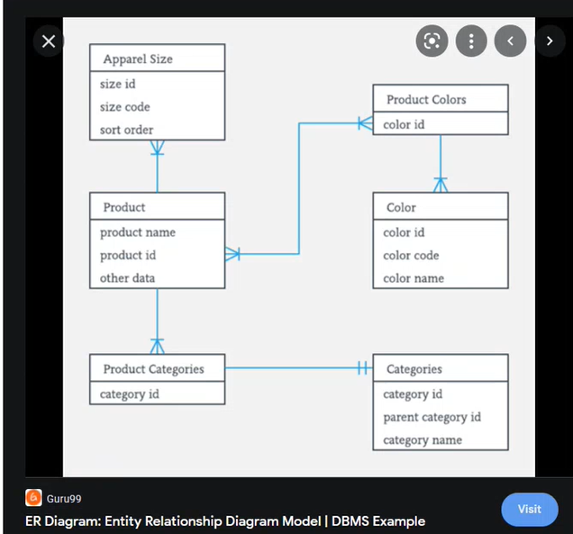

Gạch chân, tô màu

Chuyển đổi OLTP sang OLAP
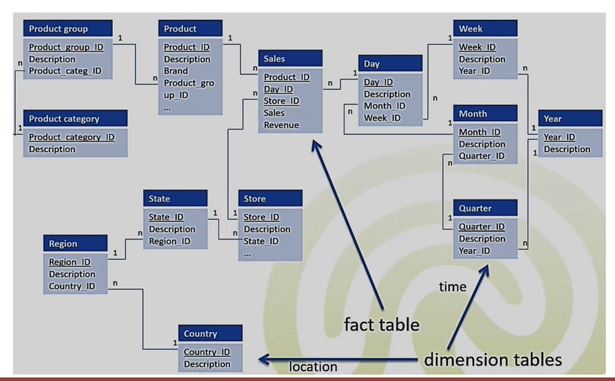
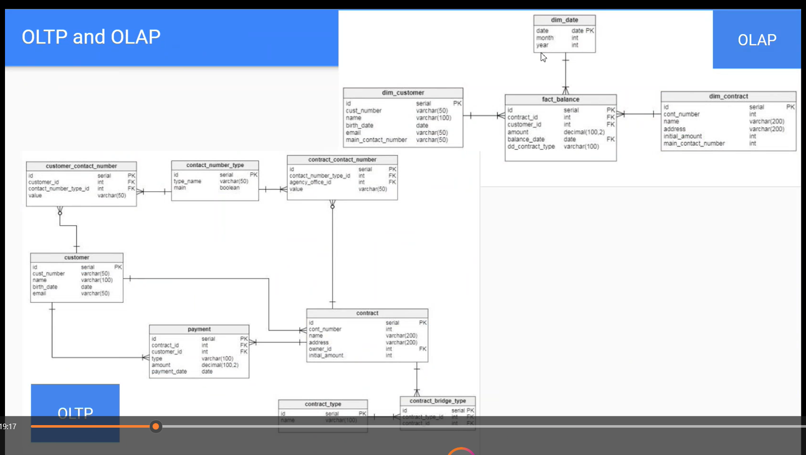

# Xây dựng Dashboard

## Mã QR Dashboard

🍀 Bước 5: Phân tích đa chiều
Ở bước này, bạn có thể phân tích một chủ điểm dựa cần phần tích (facts) trên một hệ thống các báo cáo nhìn cùng một lúc gọi là dashboard.
Điều này giống như bạn nhìn hệ thống camera giám sát an ninh tại một tòa nhà hay hệ thống điều phối giao thông.

Thông qua các slice & dice cắt lớp sẽ giúp bạn mổ xẻ và phân tích được chi tiết dữ liệu hơn.
Bạn sử dụng các thao tác:
👉 Slice
👉 Dice
👉 Pivot
👉 Rollup
👉 Drill Down
để phân tích.

<!-- ✍️ Hướng dẫn: bạn kết hợp với tính năng pivot table, pivot chart, slicer, timeline, sparkline,... để tạo một dashboard -->

Dashboard

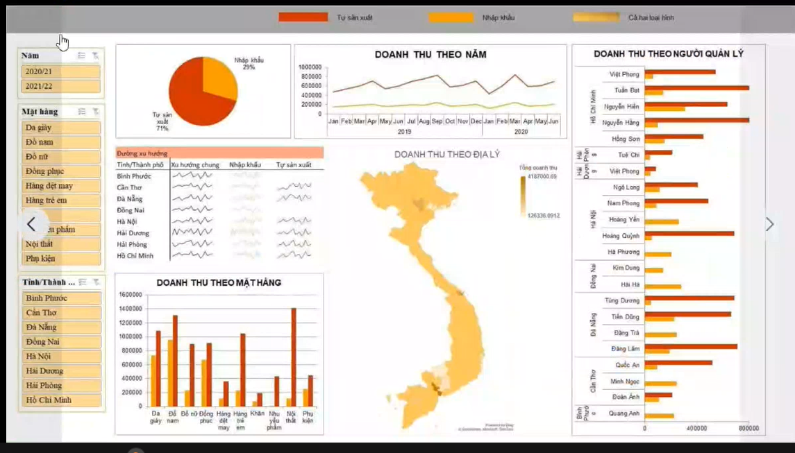

# Tổng kết

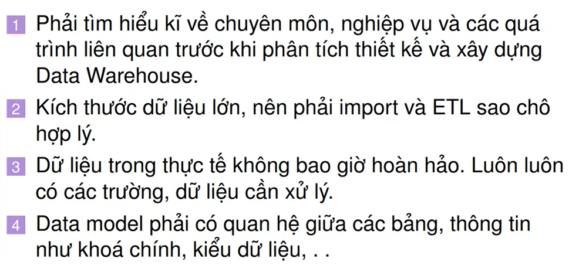
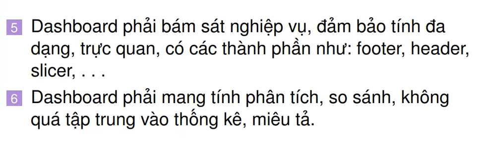

<!--  -->

https://www.kaggle.com/docs/api
https://www.kaggle.com/code/colara/human-resources-analytics-a-descriptive-analysis
https://www.kaggle.com/datasets/rishikeshkonapure/hr-analytics-prediction
https://www.kaggle.com/code/jacksonchou/hr-analytics
https://www.kaggle.com/datasets/davidepolizzi/hr-data-set-based-on-human-resources-data-set
https://www.kaggle.com/datasets/rhuebner/human-resources-data-set
https://www.kaggle.com/code/sayamkumar/employee-attrition-prediction/input
https://www.kaggle.com/datasets/rhuebner/human-resources-data-set/data

<!-- https://downloadlynet.ir/2024/28/116039/01/machine-learning-data-science-with-python-kaggle-pandas/20/?#/116039-udemy-182411021524.html -->
<!-- https://downloadlynet.ir/2024/28/116043/01/machine-learning-data-science-with-python-kaggle-a-z/21/?#/116043-udemy-182411020524.html -->

Các từ khóa bạn có thể tham khảo như:
👉 Issue tree
👉 Data analysis taxonomy
👉 Logic tree MECE
👉 Fishbone Diagram
Mình có gửi một số hình vẽ tổng hợp kiến thức như
👉 Business Analytics
👉 Data platform
👉 Data Taxonomy

link hướng dẫn vẽ cây phân tích vấn đề:
https://www.prezent.ai/learn-guides/issues-trees
link hướng dẫn vẽ cây phân tích vấn đề lợi nhuận:
https://www.craftingcases.com/profitability-tree-guide/
link bài viết trên này trên website:
https://hocexcelcoban.com/mindmap-ung-dung-trong-phan.../
Trước đi làm thì mình có sử dụng một dạng biểu diễn đa chiều hơn cây phân tích là dạng bảng cho phép thể hiện được nhiều thông tin hơn.

# AI: Data Mining (Khai phá dữ liệu)

🍀 Bước 6: Khai phá dữ liệu (Data mining)
Bạn áp dụng các mô hình, phương pháp học sâu,... để tìm ra các thông tin sâu hơn từ tập dữ liệu.
🌳 Ví dụ:
👉 Khách hàng khi mua sản phẩm A thì hay quan tâm tới sản phẩm nào khác
👉 Các hành gian lận hay có các dấu hiệu gì
👉 Dự báo được kế hoạch kinh doanh cho chu kỳ tiếp theo
👉 Xu hướng sản phẩm đang dịch chuyển theo hướng nào

<!--  -->
