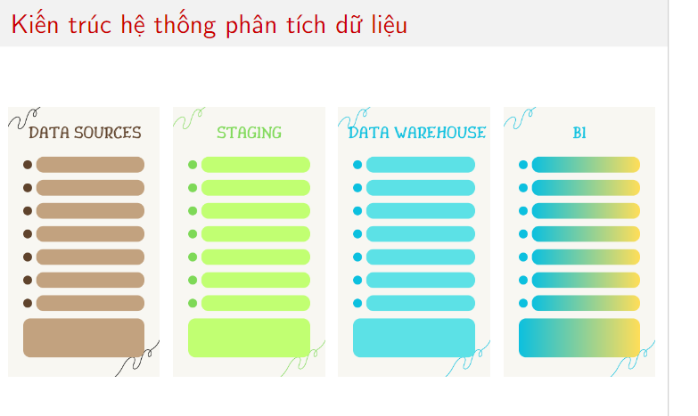

HRM

Chủ đề: Human Resources Management

GVHD: ThS. Nguyễn Danh Tú

[Data Warehouse \& BI]

#

Nhóm 22:

Nguyễn Việt Anh 20216796

Phùng Quốc Đạt 20216813

Vũ Văn Nghĩa 20206205

Mai Thị Tuyết Nhung 20216866

#

# Khảo sát

#

## Giới thiệu về HRM

HRM là gì?

% https://talentbold.com/hrm-la-gi-tat-tan-tat-ve-human-resource-management-939-ns

% https://en.wikipedia.org/wiki/Human_resource_management

#

## Business Model Canvas

<!-- https://som.edu.vn/mo-hinh-business-model-canvas-la-gi/ -->
<!-- % https://www.canva.com/design/DAGDrYFhMzE/9A5DeAlx2KgP-Aa-wmN-Nw/edit?utm_content=DAGDrYFhMzE&utm_campaign=designshare&utm_medium=link2&utm_source=sharebutton -->

#

# Phân tích và Thiết kế

#

## Kiến trúc hệ thống phân tích dữ liệu

<!-- % https://www.canva.com/design/DAGDr5h1pEE/gsFg-GK1Y2-pzTf8nBDexA/edit?utm_content=DAGDr5h1pEE&utm_campaign=designshare&utm_medium=link2&utm_source=sharebutton -->

<!-- % https://www.canva.com/design/DAGDrwKlKDU/5tBfEI7Mzsp5s6nIUIs7Tw/edit?utm_content=DAGDrwKlKDU&utm_campaign=designshare&utm_medium=link2&utm_source=sharebutton -->

<!-- % https://www.canva.com/design/DAGDr7K5Yq0/Z64jK07TlLNI0mGCIvUdrQ/edit?utm_content=DAGDr7K5Yq0&utm_campaign=designshare&utm_medium=link2&utm_source=sharebutton -->

<!-- % https://www.canva.com/design/DAGDrwE3P6s/0GVeEFesokKj0oLIIrbjhg/edit?utm_content=DAGDrwE3P6s&utm_campaign=designshare&utm_medium=link2&utm_source=sharebutton -->

#

## ETL

BEFORE

AFTER

#

#

XSTK: Data exploxxxxxxxxxx  
EDA
taxpomy

#

AI: Data miniming mmmmmmmmmmmmmmmm

#

# Xây dựng Dashboard

#

## Mã QR Dashboard

#

# Tổng kết

<!-- https://www.kaggle.com/code/colara/human-resources-analytics-a-descriptive-analysis -->

<!-- https://www.kaggle.com/datasets/rishikeshkonapure/hr-analytics-prediction -->

<!-- https://www.kaggle.com/code/jacksonchou/hr-analytics -->

<!-- https://www.kaggle.com/datasets/davidepolizzi/hr-data-set-based-on-human-resources-data-set -->

<!-- https://www.kaggle.com/datasets/rhuebner/human-resources-data-set -->

<!-- https://www.kaggle.com/code/sayamkumar/employee-attrition-prediction/input -->

<!-- https://www.kaggle.com/docs/api -->

<!-- https://www.kaggle.com/datasets/rhuebner/human-resources-data-set/data -->

<!-- https://www.kaggle.com/datasets/sherrytp/airline-delay-analysis?fbclid=IwAR2wsZkBGKgSIZj29PQLxTqLvoqG9HuLFjCWxrKztTzGRuGAOG5EiqqhvVg -->

<!-- https://downloadlynet.ir/2024/28/116039/01/machine-learning-data-science-with-python-kaggle-pandas/20/?#/116039-udemy-182411021524.html -->

<!-- https://downloadlynet.ir/2024/28/116043/01/machine-learning-data-science-with-python-kaggle-a-z/21/?#/116043-udemy-182411020524.html -->
