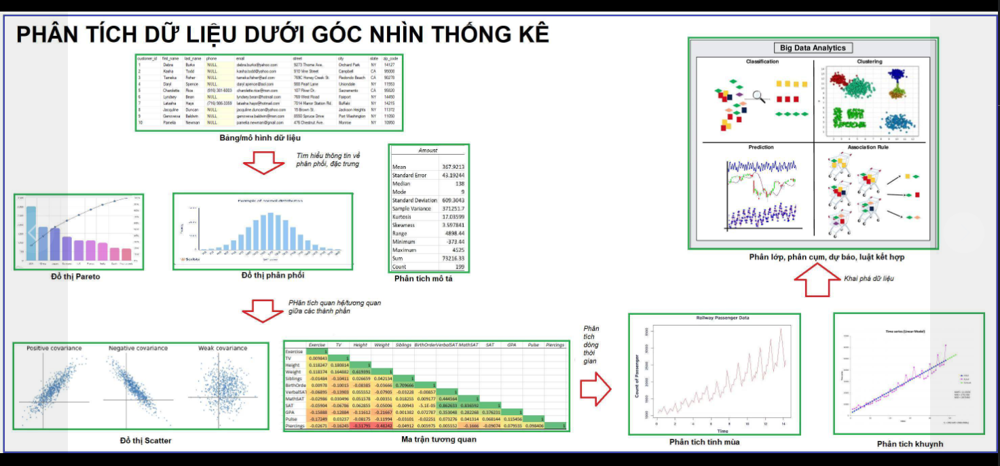
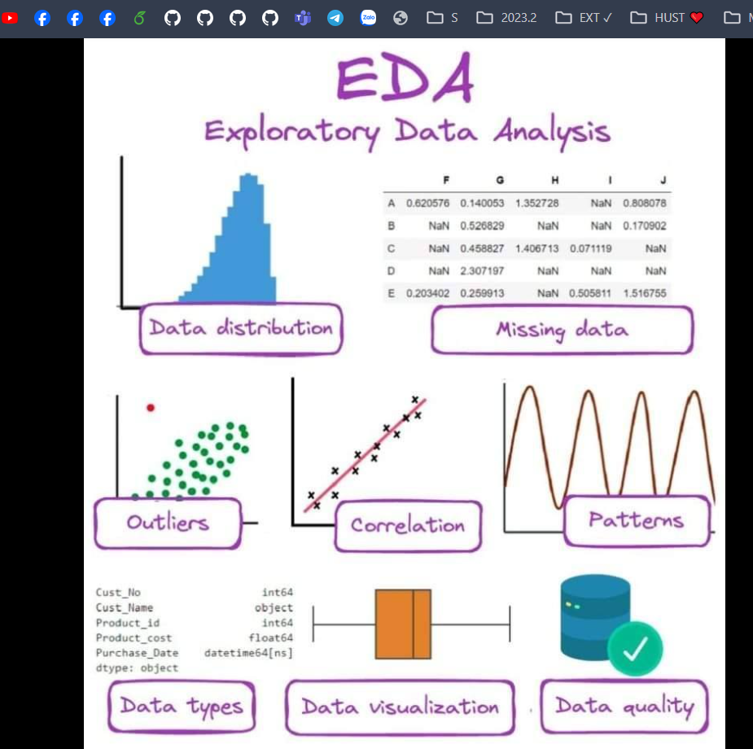

## Khám phá dữ liệu

taxpomy

<!-- 🍀 Bước 3: Phân tích phân phối và đặc trưng của từng chiều -->

Sau khi liệt kê từng chiều. Bạn có thể tiến tới phân tích phân phối, đặc trưng của từng chiều đó.

Ta có thể mô tả phân bố này trên nhiều fact với cùng 1 dim.
🌳 Ví dụ:
👉 Phân bố doanh thu theo khu vực
👉 Phân bố khách hàng theo khu vực
👉 Phân bố doanh thu theo kênh marketing
👉 Phân bố khách hàng theo độ tuổi
👉 Phân bố các dự án theo mã nguồn
👉 Phân bố thời lượng sử dụng ứng dụng theo thời gian (khung giờ, tuần, ngày,...)

Từ đó bạn cũng tính được các đặc trưng như:
👉 doanh thu trung bình một đơn hàng
👉 Độ tuổi trung bình của khách hàng
👉 Khung giờ nào user vào ứng dụng nhiều nhất,...

<!-- ✍️ Hướng dẫn: bạn sử dụng tính năng pivot table, pivot chart hoặc sử dụng add-in Data Analysis để thống kê và vẽ các đặc trưng này -->

<!-- ! -->

<!-- 🍀 Bước 4: Phân tích tương quan -->

Tiếp theo sau khi tìm hiểu phân phối. Ta đi vào điểm hiểu mối quan hệ giữa các thành phần với nhau.

Mối quan hệ giữa dim-dim; dim-fact; fact-fact
🌳 Ví dụ:
👉 Mối quan hệ giữa thời gian gọi điện chăm sóc và tỷ lệ chuyển đổi
👉 Khu vực chứa các tỉnh thành hay tỉnh thành chứa các khu vực hay không liên quan tới nhau
👉 Mối quan hệ giữa độ tuổi và hạn mức tín dụng
👉 Mối quan hệ giữa thu nhập và khả năng chi trả
👉 Mối quan hệ giữa chi phí marketing và doanh số
👉 Mối quan hệ giữa giá trị một đơn hàng và tỷ lệ chuyển đổi

<!-- ✍️ Hướng dẫn: bạn sử dụng tính năng pivot table, pivot chart hoặc sử dụng add-in Data Analysis để thống kê và vẽ các đặc trưng này -->